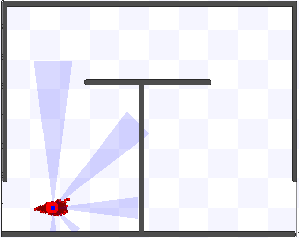

# particle-filter
Optimized Particle Filter Software for robot localization

This repository has implementations of the particle filter algoritm in the following flavors:
  - pure matlab, found in /src/matlab. This example includes a simulation environment and an example map. It is very slow and it is hard to simulate another map. Requires matlab.
  - matlab with MEX, found in /src/matlab_mex. Same as the previous one, but it is much faster, enabling to simulate several hundreds of particles.
  - C, found in /src/c. This one is not 100% C since it still requires some .mat files as inputs and it generates a .mat with outputs (a vector of particles per iteration). However, it does not run in the Matlab environment.
  - Stage, found in /stage directory. It implements the filter within the Stage simulation tool. For your convecience we included the entire Stage with our filter code included. By using Stage, it is way easier to change the environment, add diferent maps and to include multiple robots. On the other hand, it might require some coding if one tries to change the robot model, for instance, increasing the number of sonars.
  

All examples were executed on Ubuntu 14.04 LTS. 

The documentation is in Portuguese, but you can try a Google Translante with fair results.
